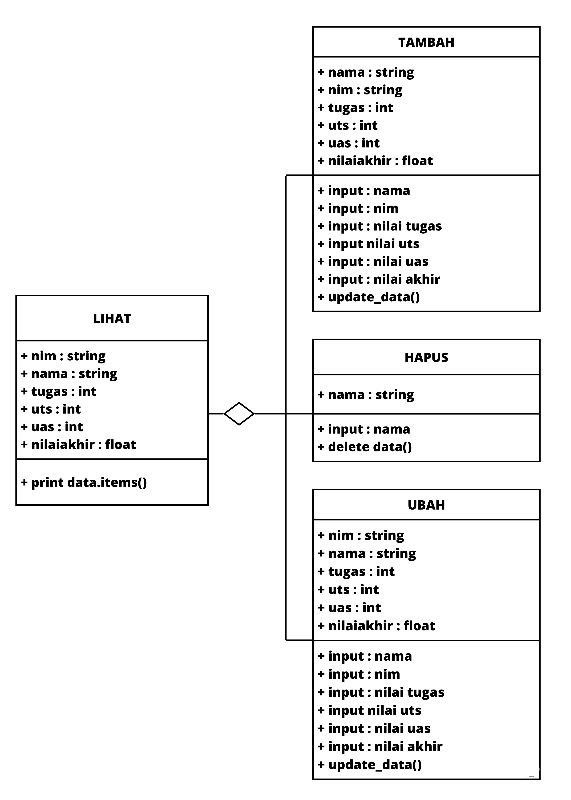
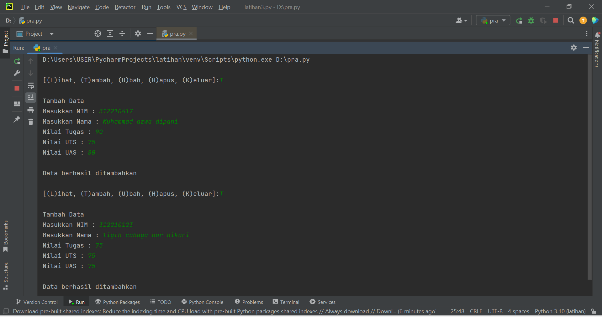
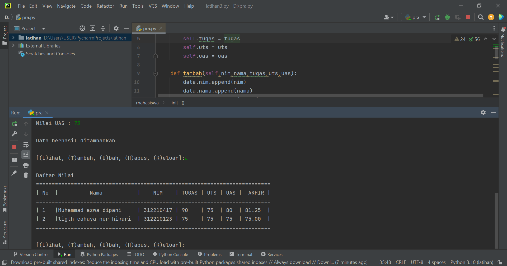
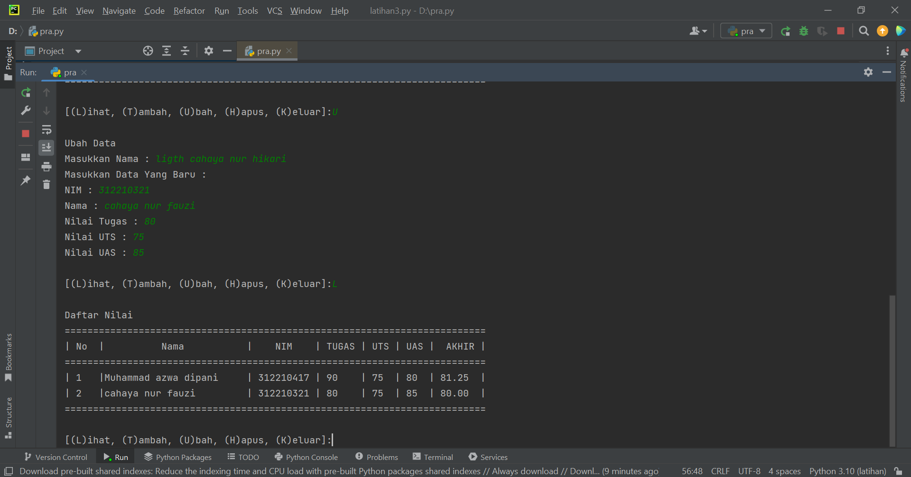
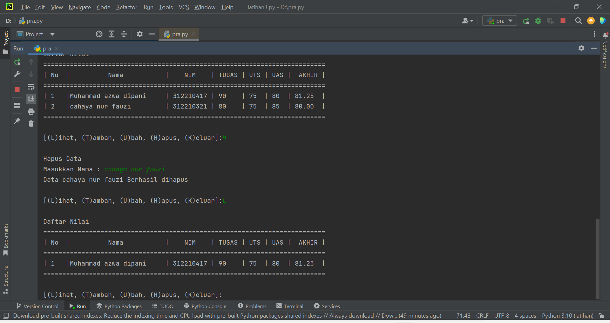

# Praktikum8

Buat program sederhana dengan mengaplikasikan penggunaan class. Buatlah class untuk menampilkan daftar nilai mahasiswa, dengan ketentuan:

1. Method tambah() untuk menambah data
2. Method tampilkan() untuk menampilkan data
3. Method hapus() untuk menghapus data berdasarkan nama
4. Method ubah() untuk mengubah data berdasarkan nama
5. Buat diagram class, flowchart dan penjelasan programnya pada README.md.
6. Commit dan push repository ke github.

## Diagram Class

## Flowchart

## Penjelasan Program

1. mendeklarasikan sebuah class mahasiswa yang didalamnya terdapat atribut NIM, Nama, nilai tugas, nilai UTS dan nilai UAS. Jangan lupa, untuk mendeklarasikan sebuah class didalam OOP kita harus menggunakan def__init__ dan juga self.

2. deklarasikan satu dictionary kosong sebagai tempat menyimpan data-data yang sudah kita input. Ada 5 list kosong yang nantinya berisi NIM, Nama, nilai tugas, nilai UTS dan nilai UAS.

3. buat beberapa method untuk menambahkan, menampilkan, menghapus, mengubah data mahasiswa. Pertama membuat method tambah(), method ini berfungsi untuk menambahkan data. Dalam method ini kita menggunakan append() supaya data yang terakhir ditambahkan ada di urutan list paling akhir.

4. Ini contoh outputnya:

5. Fungsi membuat method lihat() yaitu untuk menampilkan seluruh data yang sudah kita tambahkan tadi. Jika tidak ada data sama sekali, maka akan muncul tulisan TIDAK ADA DATA.

ini output jika menginput method (lihat):

6. Fungsi membuat method ubah() yaitu untuk mengubah data. jika method ini diinput, maka data Nama, NIM, nilai tugas, nilai UTS, nilai UAS index nomor - (no) akan diubah sesuai dengan inputan dari user. Index ke - (no) akan dicari secara otomatis sesuai dengan nama yang ingin diubah oleh user.

ini output jika menginput method (ubah):

7. Terakhir buat method hapus(), yang berfungsi untuk menghapus data berdasarkan nama. Kita bisa menggunakan del untuk menghapus datanya. Seperti sebelumnya, nomor index list yang akan dihapus disesuaikan dengan inputan dari user. Yaitu index nomor ke - (no).

ini output jika menginput method (hapus)

### Sekian dan Terima kasih